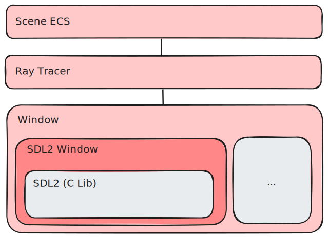

 

> [!WARNING]  
> Under [active](#progress-notes) development 🔥

# mo3d

### [mojo](https://docs.modular.com/mojo/manual/) 3d library

`mo3d` is aiming to be a 3d graphics library built from the ground up in Mojo, with minimal external dependencies. It utilizes only a basic subset of `SDL2` for rendering, employing parallelized copying of Mojo-rendered scenes directly to texture data. Unlike traditional shader pipelines, `mo3d` aims to rethink rendering by consolidating shaders into Mojo code, while planning for future support of Mojo’s hardware accelerators.

Key features aim to include an experimental ECS-based architecture for efficient scene management and ray/path tracing as the default rendering method, to capitalize on modern GPU hardware with ray tracing cores. Future goals include integrating a minimal physics engine, creating a complete 3d simulation environment akin to a lightweight version of NVIDIA’s Omniverse, focused on simplicity, composability and high performance.

`mo3d` could serve as a foundation for game engines, providing an optimized and flexible base for interactive 3D environments. Additionally, its potential to support simulation environments makes it ideal for reinforcement learning (RL) use cases, where optimization is crucial. By allowing render code and neural network forward/backward pass code to be co-compiled and optimized by [mojo](https://docs.modular.com/mojo/manual/) , `mo3d` aims to minimize latency in the RL loop. Differentiable rendering techniques could further enable seamless integration between RL agents and rendered environments, facilitating single differentiable passes for tasks such as RL agent training, gradient calculation, and environment interaction.

### attribution and inspiration
- [mojo-sdl](https://github.com/msteele/mojo-sdl/) (this code was mildly edited, but is pretty much verbatim as the base `sdl_window` implementation)
- [ray tracing in one weekend](https://raytracing.github.io/books/RayTracingInOneWeekend.html) / [the next week](https://raytracing.github.io/books/RayTracingTheNextWeek.html) / [rest of your life](https://raytracing.github.io/books/RayTracingTheRestOfYourLife.html) (all the ray tracing core ideas are attributed to these guides)
- [three.js](https://github.com/mrdoob/three.js/) (example of a successful 3d library for javascript)
- [magnum-graphics](https://magnum.graphics/) (example of a c++ middleware library for graphics)
- [bevy](https://bevyengine.org/) (example of a lightweight ECS game engine for rust)
- [taichi](https://github.com/taichi-dev/taichi) (great examples of compute on sparse data and differentiable programming)
- [openvdb](https://github.com/AcademySoftwareFoundation/openvdb) (this could be a interesting integration in the future and/or futher inspiration for spare data representations)
- (I also did a similar thing in rust wgpu and webgpu shaders [previously](https://github.com/thomas-gale/monte-carlo) which I will likely draw knowledge from)

### Basic Architecture

## dev
- install [`magic`](https://docs.modular.com/magic/#install-magic)
- see available tasks with `magic run list`
- main app `magic run start`

## progress notes

### 2024-09-09: moving to the magic package manager
- This replaces the `Makefile`
- The environment setup (installing sdl2) is cached based on a proxy of the local `pixi.toml` file - given the stability of `sdl2` API, this should be adequate.
- Other commands should do appropriate caching for extra wonderful speedyness. 

### 2024-08-30: arcball camera implemented and refactoring `vec`/`mat` to be dimensionally parameterized
- Vec4 is now `Vec` - Backing storaged is directly managed via `UnsafePointer`
- Matrix `Mat` - Backing storage is directly managed via `UnsafePointer` (I initially tried owning `dim` number of `Vec`s however, I ended up struggling to convince mojo to not prematurly deallocate them. So instead, now, `Mat` carves out it's own memory and copies to and from `Vec` when required.
- Arcball camera implemenation - many thanks to [this](https://asliceofrendering.com/camera/2019/11/30/ArcballCamera/) article!

https://github.com/user-attachments/assets/480e9b67-529a-4f3b-9a3b-843bfa9760db

### 2024-08-27: refactoring ray, adding hittables, basic ray multi-sampling to update a progressive texture
- Struggling to get a proper generic/runtime polymorphic hittable implementation working.
- Couple of concrete/leaky dependencies in the ray_color/HittableList implementations.
- Added SIMD/generic Interval implementation.
- Added camera implementation.
- Adding basic diffuse lambertian material
- Replaced the Tensor with my own UnsafePointer texture state implementation.
- Progressive rendering to the texture state, so rather than multiple samples in a single pass, the image samples and re-renders, this keeps the frame time at around `10ms` on mac m3.

### 2024-08-23: wrapping sdl2 in a window trait and battling with over eager resource freeing by mojo
- Took longer that I would have liked to track down the mysterious/non-deterministic corrupted data being rendered in the main loop
- The solution was to signal to mojo that variables captured/referenced within the render kernel should not be deleted till after the main loop
- Finally have the basic ray shooting background from Ray Tracing in One Weekend
- Stats `CPU`:`Ryzen 7 5800X 8-Core` `Window Size`:`800x450` had an average compute time (shoot rays) of `0.80 ms` & average redraw time (copy tensor to gpu texture) of `3.03 ms`

### 2024-08-22: working directly on the raw texture data from SDL_LockTexture
- Had to remove the SIMD stuff from redrew as we can't be sure of byte alignment of the texture data which is managed memory from SDL2.
- Had to ensure that Mojo didn't attempt to tidy up/mess with the UnsafePointers before SDL_UnlockTexture was called (using `_ = ptr` pattern/hack)
- We have Mojo CPU parallelized (for each row) operations directly on the SDL2 texture data (STREAMING type)
- Parallelized row texture update redraw time down to ~1.5 ms (~4 ms without `parallelized`)
- We can use this approach to quickly move (in the future) a Mojo managed Tensor (hopefully on GPU) which contains our view of the world into SDL2's texture which is being rendered in a window (e.g. in ~1.5ms)

### 2024-08-18: migrated to mojo nightly!

### 2024-08-15: interleaved SIMD tensor
- Using SIMD [interleaving](https://docs.modular.com/mojo/stdlib/builtin/simd/SIMD#interleave) on the 3rd dimension `channels` in (tensor `t`)

### 2024-08-11: hello window
- Basic window rendering on linux (within vscode devcontainer on windows) and mac
- Basic kernel, however, need to refine the vectorized worker code that sets the pixel stage (tensor `t`)

